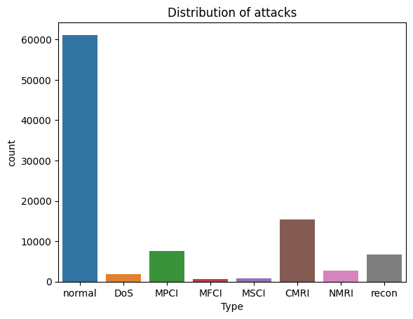
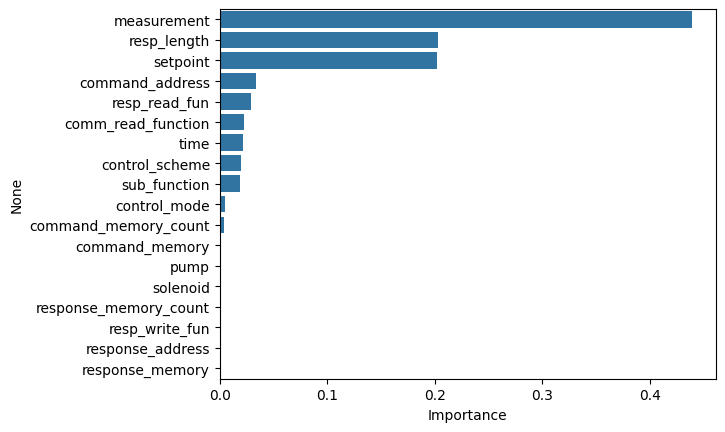
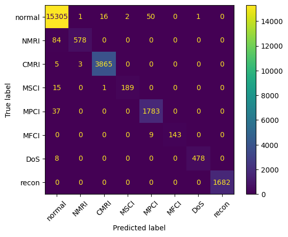

## Detecting and Classifying Attacks on Industrial Systems

## Context and objective

Cyberattacks represent a significant challenge within the industrial sector, exacerbated by the proliferation of interconnected systems and devices, consequently escalating the expenses associated with cybercrime and malware. The potential repercussions of an assault on critical infrastructure are severe. Nonetheless, the integration of artificial intelligence (AI) offers a promising solution by enabling real-time anomaly detection and threat mitigation through data analysis. This capstone project endeavors to investigate data extracted from an industrial control system utilized in a gas pipeline, as delineated in the scholarly work titled "Industrial Control System Network Traffic Data sets to Facilitate Intrusion Detection System Research" authored by Tommy Morris and Wei Gao. The objective is to devise a model capable of identifying and categorizing simulated attacks, while also shedding light on the potential of AI in addressing cyber threats within our increasingly interconnected environment.

## Data
The data set contains the following 27 features:

* Attributes of command-response pair
  - `command_address` - device ID in command packet
  - `response_address` - device ID in reponse packet
  - `command_memory` - memory address in command packet
  - `response_memory` - memory address in reponse packet
  - `command_memory_count` - bytes in memory for read and write command
  - `response_memory_count` - bytes in memory for read and write response
  - `command_length` - length of command packet
  - `resp_length` - length of response packet
  - `time` - elapsed time between command and response
  - `crc_rate` - CRC error rate
* Packet payload attributes
  - `comm_read_function` - value of read command function code
  - `comm_write_fun` - value of write command function code
  - `resp_read_fun` - value of read response function code
  - `resp_write_fun` - value of read response function code
  - `sub_function` - value of sub-function code
  - `measurement` - pipeline pressure
  - `control_mode` - categorical variable indicating the system's control mode (0 = shutdown, 1 = manual, 2 = automatic)
  - `pump` - categorical variable indicating the pipeline's compressor state (0 = inactive, 1 = active)
* Gas pipeline attributes
  - `setpoint` - configured gas pipeline pressure
  - `control_scheme` - gas pipeline control scheme
  - `solenoid` - state of the solenoid used to control the pressure relief valve (0 = inactive, 1 = active)
  - `gain` - value of gain parameter in PID controller
  - `reset` - value of reset parameter in PID controller
  - `deadband` - value of dead gain parameter in PID controller
  - `rate` - value of rate parameter in PID controller
  - `cycletime` - value of cycle time parameter in PID controller
* Target variable
  - `result` - manual classification of the attack type (0 = not an attack)

The `id` column was automatically created during the ARFF to CSV conversion process. Because each item under `id` has a unique value, this is a non-informative feature that will be removed during the data cleaning step. Furthermore, some features in the data set did not match those described in the paper. The features that were mentioned in the paper but absent from the data set are not listed here.

## Data cleaning

* The data has no missing values
* A number of columns have only one unique value; these are removed as part of the data cleaning process
* The `measurement` column contains some obviously incorrect values; these are replaced with the median value

## Business insights and recommendations

### Findings

1.Approximately one-third of all packets within the dataset are identified as components of an attack.

2.The exercise employed four distinct models: decision trees, random forests, histogram-based gradient-boosting machines, and LightGBM. All of these models exhibited high predictive performance, potentially attributed to the dataset's relative balance. However, considering the potential imbalance in real-world datasets, supplementary measures may be necessary to address this issue.

3.Upon removing low-importance features for decision tree and random forest classifiers, a negligible decrease in accuracy was observed, with no significant impact on training time.

4.Both decision tree and random forest classifiers achieved 100% accuracy on the training data and maintained high accuracy on the test data, indicating the presence of discernible patterns within the dataset rather than overfitting.

5.Considering performance metrics and runtime, either the histogram-based gradient-boosting machine or LightGBM could be chosen as the preferred model.

6.The aforementioned models were chosen for further optimization, and subsequent hyperparameter tuning resulted in identical accuracy scores for both models.

7.Experimentation revealed that utilizing the original dataset containing outliers led to higher accuracy across all models, likely because the presence of these outliers is indicative of an attack.

### Recommendations

1.In practical scenarios, the consequences of false negatives outweigh those of misclassifying legitimate traffic. Therefore, attack detection models deployed in production settings should prioritize optimization for recall or F1 score rather than accuracy.

2.Due to time constraints, hyperparameter tuning was conducted on a limited parameter set. However, in real-world contexts, it is advisable to employ a broader array of parameters to maximize predictive performance.

3.Detecting genuine cyber attacks in real-world settings may prove more challenging compared to the straightforward detection in this capstone project, as malicious actors often endeavor to obfuscate their attacks. Consequently, a production-oriented attack detection model should be trained on substantially larger datasets.

4.The computational time required for making predictions must also be taken into account when selecting a model. Failure to consider this aspect may result in a threat detection system being unable to offer real-time protection during periods of high traffic.

## Sample visualizations

* Distribution of attack types

* Feature importance from decision tree

* Confusion matrix of gradient-boosting machine

